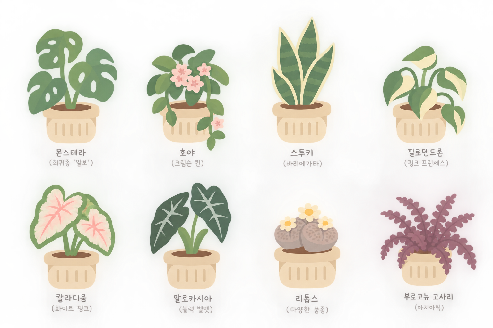
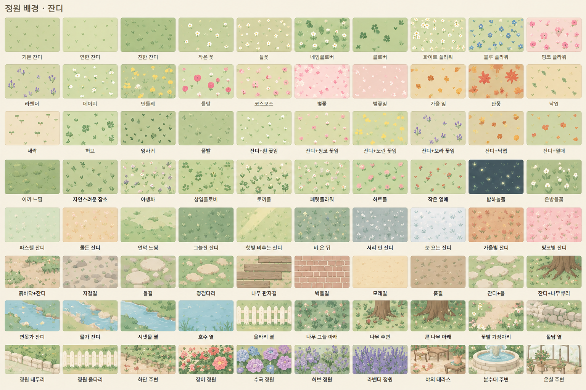
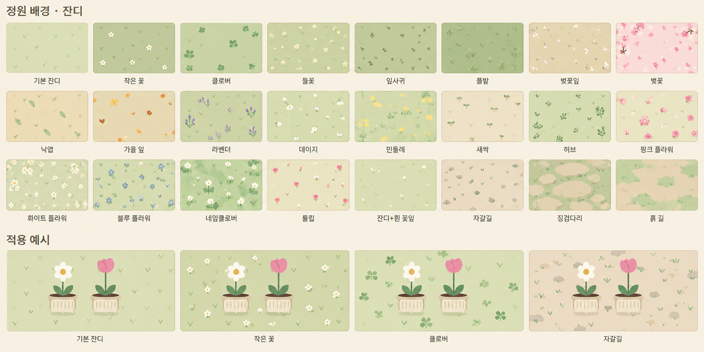
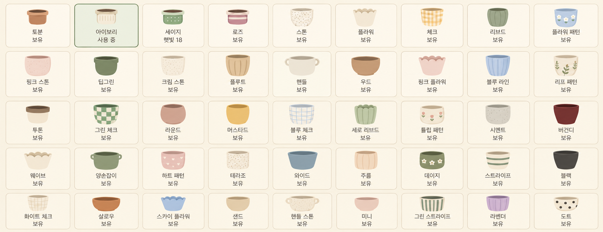

# 신규 수집 도감과 가챠 후속 기획

기준일: 2026-10-01. 사용자 제공 식물·정원·화분 디자인을 먼저 잠금 상태로 등록하고, 가챠 획득은 다음 개발 항목으로 둔다.

## 이번에 반영한 범위

- 상점 하단의 `신규 수집 도감 · 잠김`에서 식물·정원·화분 분류와 페이지를 선택한다.
- 식물 8종, 정원 배경 79종, 화분 스킨 41종, 총 128종의 그림과 이름을 표시한다. 모든 신규 항목은 `잠김`이며 미리보기만 가능하다.
- 원본 그림을 보존하고 해당 영역만 화면에 표시한다. 레퍼런스에 쓰인 `보유`, `사용 중`, 가격은 게임 상태로 가져오지 않는다.
- 기본 잔디는 기존 `grass`, 토분·아이보리·세이지·로즈는 기존 `terracotta`·`ivory`·`sage`·`rose`로 유지한다. 기존 소유권·가격·모양은 변경하지 않는다.
- 정원 확대 예시 시트의 중복 디자인은 별도 항목으로 추가하지 않는다. 기존 단색 라벤더 배경과 신규 라벤더 꽃무늬 배경은 구분한다.
- 신규 항목은 재배 씨앗 목록, 랜덤 씨앗 풀, 햇빛 상점의 구매·적용 목록에서 제외한다. 충분한 재화를 보유해도 획득할 수 없다.
- 도감 열람은 저장 데이터를 변경하지 않는다. 저장 버전 v13과 기존 클라우드 복원 구조를 유지한다.
- Python BAT 및 EXE 패키지에 도감 그림이 포함되도록 빌드를 연결한다. 이 변경 자체로 새 Release를 발행하지 않는다.

## 신규 식물 8종

1. 몬스테라 알보
2. 호야 크림슨 퀸
3. 스투키 바리에가타
4. 필로덴드론 핑크 프린세스
5. 칼라디움 화이트 핑크
6. 알로카시아 블랙 벨벳
7. 리톱스
8. 부르고뉴 고사리

품종명은 제공된 레퍼런스의 표시를 따른다. 식물별 성장 기간·씨앗 가격·판매가·돌봄 주기와 성장 단계 그림은 아직 정하지 않는다.

## 정원 배경 79종

원본 80종 가운데 기존 기본 잔디를 제외한다.

| 묶음 | 신규 배경 |
|---|---|
| 잔디·기본 꽃무늬 | 연한 잔디, 진한 잔디, 작은 꽃, 들꽃, 네잎클로버, 클로버, 화이트 플라워, 블루 플라워, 핑크 플라워 |
| 꽃·계절 | 라벤더, 데이지, 민들레, 튤립, 코스모스, 벚꽃, 벚꽃잎, 가을 잎, 단풍, 낙엽 |
| 잎·혼합 | 새싹, 허브, 잎사귀, 풀밭, 잔디+흰 꽃잎, 잔디+핑크 꽃잎, 잔디+노란 꽃잎, 잔디+보라 꽃잎, 잔디+낙엽, 잔디+열매 |
| 자연·야생화 | 이끼 느낌, 자연스러운 잡초, 야생화, 삼잎클로버, 토끼풀, 패랭꽃, 하트풀, 작은 열매, 밤하늘풀, 은방울꽃 |
| 날씨·색감 | 파스텔 잔디, 물든 잔디, 언덕 느낌, 그늘진 잔디, 햇빛 비추는 잔디, 비 온 뒤, 서리 낀 잔디, 눈 오는 잔디, 가을빛 잔디, 핑크빛 잔디 |
| 길·지면 | 흙바닥+잔디, 자갈길, 돌길, 징검다리, 나무 판자길, 벽돌길, 모래길, 흙길, 잔디+돌, 잔디+나무뿌리 |
| 주변 환경 | 연못가 잔디, 물가 잔디, 시냇물 옆, 호수 옆, 울타리 옆, 나무 그늘 아래, 나무 주변, 큰 나무 아래, 꽃밭 가장자리, 돌담 옆 |
| 정원·시설 | 정원 테두리, 정원 울타리, 화단 주변, 장미 정원, 수국 정원, 허브 정원, 라벤더 정원, 야외 테라스, 분수대 주변, 온실 주변 |

## 화분 스킨 41종

원본 45종 가운데 기존 토분·아이보리·세이지·로즈를 제외한다.

| 묶음 | 신규 스킨 |
|---|---|
| 1 | 스톤, 플라워, 체크, 리브드, 플라워 패턴 |
| 2 | 핑크 스톤, 딥그린, 크림 스톤, 플루트, 핸들, 우드, 핑크 플라워, 블루 라인, 리프 패턴 |
| 3 | 투톤, 그린 체크, 라운드, 머스터드, 블루 체크, 세로 리브드, 튤립 패턴, 시멘트, 버건디 |
| 4 | 웨이브, 양손잡이, 하트 패턴, 테라조, 와이드, 주름, 데이지, 스트라이프, 블랙 |
| 5 | 화이트 체크, 샬로우, 스카이 플라워, 샌드, 핸들 스톤, 미니, 그린 스트라이프, 라벤더, 도트 |

## 다음 개발: 가챠 획득과 적용

현재 상태는 **잠금 도감 구현 / 가챠 미구현**이다. 아래 항목은 다음 개발 시 구체화하고 구현한다.

1. **경제 규칙 결정:** 사용할 재화, 1회 비용, 식물·정원·화분 통합 또는 분리 여부, 등급·확률·천장, 중복 획득 보상을 정한다. 유료 결제나 실제 돈 사용은 이번 요청 범위에 포함하지 않는다.
2. **결과와 안내:** 뽑기 전 비용·확률·보상 목록을 확인하고, 결과에서 신규 해금과 중복 보상을 구분한다. 잔액 부족·중복 클릭·저장 실패에서 재화가 유실되거나 결과가 중복 지급되지 않도록 한다.
3. **식물 해금:** 한 번 획득한 식물이 씨앗 구매 권한인지, 씨앗 수량인지, 완성 화분인지 결정한다. 성장 단계와 재배 수치를 정한 뒤 재배·보관·판매·바탕화면 플로팅을 연결한다.
4. **꾸미기 적용:** 배경은 정원 전체에 자연스럽게 표시하고 꽃·햇빛·드래그 동작을 유지한다. 화분 스킨은 재배·정원·바탕화면 플로팅에 공통 적용한다. 현재의 시트 미리보기와 실제 적용용 그림을 구분한다.
5. **보유와 저장:** 도감 항목의 `catalog_plant_*`, `catalog_garden_*`, `catalog_pot_*` ID를 유지하고, 영구 해금·중복 보상·선택 상태를 저장한다. 기존 정원과 소유권을 이전하며 Drive 복원에서도 해금이 유지되도록 한다.
6. **검수:** 신규 계정 잠금, 정상 획득, 중복, 잔액 부족, 연속 클릭, 저장 실패, 재실행·클라우드 복원, 모든 화면의 꾸미기 적용을 검증한다. 실제 뽑기 UI는 구현 시 검수한다.

아직 확정하지 않은 비용·확률·재배 수치를 임시로 게임에 적용하지 않는다. 기존 랜덤 씨앗과 고대 꽃 0.1% 규칙은 별도 기능으로 유지한다.
