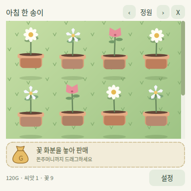

# 정원·순환 메뉴 수정 기획

요청일: 2026-09-15. 기준 코드: `main`의 `53a7f3a`.
상태: 구현·검증 후 `897b608`로 GitHub `main`에 반영했다. EXE 릴리스 게시·자동 업데이트 배포는 보류 중이다. 후속 [햇빛 수집·꾸미기 기획과 개발자 모드](sunlight-interaction.ko.md)는 별도로 구분한다.

후속 수정: 2026-09-16 개별 재배 화분은 양 끝에서 멈추는 슬라이드로 변경했다. 재배·상점의 씨앗은 봉투 아이콘으로 선택하고, 버튼과 색감은 코티지 스타일로 정리했다. 상단 화면 메뉴의 순환은 유지한다.

## 1. 가방을 정원으로 변경

가방의 텍스트 꽃 목록을 없애고, 수집한 꽃을 초록 잔디 위의 꽃+화분 그림으로 보여준다. 데이지·별꽃·튤립은 재배 화면과 같은 도형을 사용하며 개화한 모습으로 전시한다. 화분 아래 그림자와 작은 상하 움직임으로 떠 있는 느낌을 준다. 별도 이미지 파일이나 이모지 글꼴에 의존하지 않는다.

- 수집한 꽃 한 개체당 꽃 화분 하나를 표시한다. 같은 품종도 개별 개체로 유지한다.
- 창 너비에 맞춰 자동 정렬하고, 꽃이 많으면 잔디 영역만 세로 스크롤한다.
- 이름과 판매가는 꽃을 가리켰을 때 도움말로 확인한다. 이름을 나열하는 목록은 사용하지 않는다.
- 빈 정원에는 수확한 꽃을 정원에 보관하라는 안내를 표시한다.
- 수확 버튼은 `정원 보관`으로 표시한다. 씨앗 수량 확인과 심기는 `화분` 화면에 둔다.
- 정원에서 보이는 화분은 수집 꽃의 시각적 표현이다. 재배 화분 슬롯을 추가로 소비하지 않으며, 판매해도 재배 슬롯 수는 줄지 않는다.

## 2. 돈주머니 드래그 판매

정원 아래쪽에 돈주머니 그림이 있는 고정 판매 영역을 배치한다. 꽃 화분을 끌어 판매 영역에 놓으면 확인창 없이 그 꽃 한 개만 즉시 판매한다.

| 입력·상태 | 처리 |
| --- | --- |
| 꽃 클릭만 함 | 판매하지 않음 |
| 일정 거리 이상 끌기 | 꽃 그림이 커서를 따라가고 판매 예정 금액 표시 |
| 판매 영역 진입 | 영역 강조, `놓으면 +금액G` 표시 |
| 유효한 꽃을 판매 영역에 놓음 | 개체 ID로 꽃 제거, 고정된 판매가 지급, 즉시 저장 |
| 다른 곳에 놓음 또는 드래그 취소 | 꽃과 돈 유지, 원래 표시로 복귀 |
| 같은 꽃을 중복 드롭 | 두 번째 판매 무시 |
| 외부 앱·다른 창에서 끌어옴 | 거부 |
| 저장 실패 | 꽃과 돈을 복원하고 정원 화면에도 오류 표시 |

판매가는 저장된 기본 판매가+분무 보너스다. 현재 카탈로그 가격으로 다시 계산하지 않는다. 휴가 중에도 기존에 수집한 꽃은 판매할 수 있다.

## 3. 드롭다운을 순환 슬라이드로 변경

상단 메뉴를 `‹ 화분 ›` 형태의 현재 화면 이름과 좌우 화살표로 바꾼다. 약 180ms의 가로 슬라이드로 화면을 전환한다.

| 현재 화면 | 왼쪽 화살표 | 오른쪽 화살표 |
| --- | --- | --- |
| 화분 | 정원 | 상점 |
| 상점 | 화분 | 정원 |
| 정원 | 상점 | 화분 |

설정은 이 순환에 포함하지 않는다. 오른쪽 아래의 설정 버튼을 모든 화면에 유지한다. 설정에서 `돌아가기`를 누르면 설정을 열기 직전 화면으로 돌아간다. 재배·상점의 씨앗 품종은 봉투 아이콘으로 선택하며, 개별 화분 선택은 아래와 같이 변경한다.

연속 클릭이나 전환 중 창 크기 변경이 있어도 이전 애니메이션을 정리한다. 상단 메뉴 이동 자체로 저장·판매·재배 상태를 변경하지 않는다.

### 3.1. 개별 재배 화분 선택

- 화분 화면 안에 `‹ 화분 1 / 2 · 데이지 ›` 형태로 선택 번호·보유 개수·꽃 이름을 표시한다. 빈 슬롯은 `빈 화분`, 자세한 상태는 도움말과 기존 돌봄 표시에서 확인한다.
- 양쪽 꺾쇠를 누르면 해당 방향으로 약 180ms 슬라이드하며 이전/다음 화분의 그림·성장 정보·돌봄 도구를 보여준다. 첫 화분의 이전, 마지막 화분의 다음 버튼은 비활성화하며 반대 끝으로 이동하지 않는다. 범위를 벗어난 호출은 저장이나 애니메이션을 발생시키지 않는다.
- 화분이 하나면 양쪽 화살표를 비활성화한다. 두 번째 화분 구매 후 즉시 사용할 수 있다. 한 화분 상태에서 화살표를 눌러 저장이나 행동을 발생시키지 않는다.
- 선택은 즉시 저장하고 재실행·설정 복귀 시 유지한다. 저장 실패 시 선택과 표시를 이전 상태로 되돌리고 오류를 알린다.
- 물주기·분무·심기·수확은 현재 선택된 화분에만 적용한다. 다른 화분도 계속 독립적으로 성장하며, 화분을 바꿔도 성장량이나 돌봄 상태를 초기화하지 않는다. 이전 화분의 물방울 효과는 새 화분으로 옮기지 않는다.
- 연속 클릭·크기 변경·화면 이탈 시 전환 그림을 정리한다. 일반/개발자 정원을 바꾸면 해당 저장의 선택과 화분 수를 다시 표시한다.
- 현재 구매 상한은 네 개이며 화분 수가 달라져도 같은 경계 규칙을 사용한다.

### 3.2. 씨앗 봉투와 코티지 스타일

씨앗 세 품종을 한 줄의 아이콘 버튼으로 표시한다. 재배에서는 보유량, 상점에서는 가격을 이름 아래에 표시하고 선택한 항목은 세이지색 테두리로 구별한다. 품종 선택은 재화나 저장을 변경하지 않는다. 심기·구매는 별도 버튼으로 확정하고 기존 저장 실패 복원을 유지한다. 빈 화분에서는 씨앗 선택을 중심으로 보여주며 재배 중인 꽃의 화면에는 선택 목록을 숨긴다. 아이콘과 화살표는 기존 Qt 그리기로 만들고 글꼴 기호나 OS의 원형 화살표 아이콘에 의존하지 않는다. 전체 화면은 크림색 바탕, 갈색 선, 세이지색 강조와 작은 모서리 반경을 사용한다.

## 4. 최초 정원·메뉴 변경의 유지 범위

꽃 성장 시간, 씨앗 가격, 첫 물주기, 튤립 중간 물주기, 분무 보너스, 휴가 모드, 최대 두 재배 화분은 변경하지 않는다. 저장 스키마는 v4를 그대로 사용하며 기존 수집 꽃은 추가 이전 없이 정원에 표시한다. 자유 배치 위치 저장·정원 장식·판매 취소 버튼은 이번 범위가 아니다.

## 5. 최초 정원·메뉴 변경의 검증

Python 3.12 / PySide6 6.8.3 / Linux Qt offscreen에서 총 40개 테스트를 통과했다. 기존 성장·저장 테스트와 메뉴 순환, 설정 복귀, 드래그 취소·판매·중복·외부 입력·저장 실패 복원, 100개 꽃 스크롤, 320·384·520px 레이아웃을 포함한다.

Qt 드래그 진입·드롭 이벤트와 모의 드래그 실행 경로를 검증했다. 실제 Windows의 마우스 드래그, Esc 취소, 다중 모니터·고해상도 배율 동작은 Windows 수동 점검 대상으로 남긴다.

## 6. 개별 화분 슬라이드 추가 검증

PySide6 6.8.3 / Linux Qt offscreen에서 기존 75개와 화분 선택 회귀 테스트 10개, 총 85개를 통과했다. 양방향 순환·선택 저장·애니메이션 방향·한 화분과 추가 구매·저장 실패 복원·선택 대상 돌봄·다른 화분 성장·연속 클릭·크기 변경·화면 이탈·재실행·개발자 정원 전환과 320·384·520px 배치를 검사했다.

이 추가 변경은 선택 UI와 기획 문서만 수정하며 현재 저장 스키마 v5와 돌봄 규칙, 최대 두 화분을 유지한다. [타이쿤 반복 돌봄·비료·화분 수 확대](tycoon-care-fertilizer.ko.md)는 여전히 후속 기획이며 EXE 배포도 보류 상태다.
