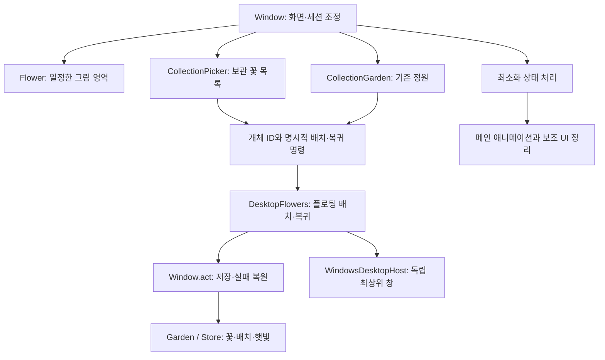

# 화분 표시 안정화·보관 꽃 플로팅·최소화 기획

작성: 2026-09-18 · 구현: 2026-09-19 · 기준: v0.7.3 이후 로컬 변경 · 상태: 구현 및 자동·Windows 네이티브 검증 완료.

## 1. 목표와 확정된 동작

같은 식물과 같은 창 크기에서 알림·돌봄 상태가 바뀌어도 그림 크기가 갑자기 줄어들지 않게 한다. 화분 화면에서 **이미 정원에 보관한 꽃 목록**을 열고, 목록의 꽃을 우클릭해 바탕화면에 띄운다. 제목줄에 브라우저처럼 `—` 최소화 버튼을 추가한다.

사용자가 선택한 플로팅 대상은 보관 꽃이다. 재배 중이거나 개화 후 아직 보관하지 않은 꽃을 이 기능으로 수확하지 않는다. 먼저 기존 `정원에 보관하기`를 거친 꽃만 목록에 나타난다.

| 기능 | 사용자에게 보이는 결과 |
| --- | --- |
| 식물 크기 안정화 | 알림 표시·숨김, 돌봄 상태 변경, 화분 이동 뒤에도 같은 창 크기에서는 같은 배율로 표시 |
| 화분 화면의 `정원 꽃 N` | 화면을 이동하지 않고 수집한 꽃의 그림 목록을 열기 |
| 목록의 꽃 우클릭 | `바탕화면에 띄우기` 또는 `정원으로 돌려놓기` 선택 |
| 제목줄 `—` | 메인 창을 작업 표시줄로 최소화; 플로팅 꽃은 계속 표시 |
| 작업 표시줄에서 복원 | 같은 페이지·화분 선택·크기·정상 위치로 복귀 |
| 제목줄 `X` | 기존 저장 후 종료; 플로팅 창도 함께 종료 |

## 2. 축소 버그 조사 결과

### 확인한 원인

이전 `app.py`의 `Flower`는 최소 높이 0과 수직 `QSizePolicy.Ignored`를 사용했다. `paintEvent()`는 `min(width / 380, height / 180)`로 식물 전체를 축소했다. 하단 `message`가 나타나거나 두 줄로 늘어나면 같은 세로 레이아웃의 꽃 영역이 줄고 그림 배율도 내려갔다. 이전 `resizeEvent()`도 꽃 최소 높이를 다시 0으로 설정했다.

**같은 성장 단계에서 알림만 바꾸어 축소를 재현했다.** 실제 사용자 화면에서 일어난 모든 축소의 원인이 이것 하나라고 확정한 것은 아니다. 화분 전환·DPI·최소화 복원은 추가 회귀 검증 범위다.

검증 환경: Windows 로컬 Python 3.11.9 / PySide6 6.8.3, Qt `offscreen`, 배포용 Noto Sans KR 서브셋. 사용자 저장 대신 임시 정원을 사용했다. 일반 데이지, 튜토리얼 보상 수령 완료, 첫 물 완료, 성장 60% 상태에서 창 크기를 고정하고 중요 안내문을 0줄 → 1줄 → 2줄 → 0줄로 바꾸었다.

| 정사각 창 한 변 | 안내 없음: 그림 영역 높이 / 화분 테두리 너비 | 두 줄 안내: 높이 / 너비 | 너비 변화 |
| --- | --- | --- | --- |
| 320 논리 px | 71 / 42.6 px | 37 / 22.2 px | 약 48% 감소 |
| 384 논리 px | 135 / 81.0 px | 101 / 60.6 px | 약 25% 감소 |
| 520 논리 px | 271 / 141.0 px | 237 / 141.0 px | 변화 없음: 너비가 배율을 제한 |

한 줄 안내에서는 320px 창의 화분 너비가 30.6px였다. 알림을 지우자 원래 크기로 돌아왔다. 수치는 렌더러의 108px 테두리 너비에 실제 배율을 적용한 값이며 화면 사진의 픽셀 측정값은 아니다. 기존 작은 창 테스트는 `flower.height() > 0`과 버튼이 창 안에 있는지만 검사하므로 이 현상을 잡지 못한다.

### 적용한 수정

1. **그림 높이를 창 크기에 따라 명시적으로 확보했다.** 320px 창에서 112px, 384px에서 152px, 520px에서 200px다. 중간 값은 `clamp(112 + (side - 320) * 0.625, 112, 200)`를 정수로 반올림한다. 같은 크기의 창에서는 알림이나 상태에 따라 달라지지 않는다.
2. 기존 `Flower`가 크기 정책과 장면 좌표 변환을 계속 담당하되 수직 정책을 `Fixed`로 바꿨다. 페인트 이벤트에서는 레이아웃이나 저장을 변경하지 않는다. 그림 배율과 화분 바닥 기준점은 같은 창 크기에서 고정하며 성장 단계 변화는 줄기·꽃 모양만 바꾼다.
3. 제목줄·화분 선택줄·그림 영역·하단 바의 높이를 고정했다. 기존 성장 상태·진행률·돌봄·비료 도구는 그림 아래 `QScrollArea` 안으로 모아, 공간 부족은 도구 영역의 세로 스크롤로 처리한다. 현재 가능한 주요 행동을 도구 상단에 두고 빈 화분의 씨앗 선택은 같은 콘텐츠 슬롯을 사용한다.
4. 안내문과 재화 표시는 하단의 같은 18px 고정 슬롯에서 전환한다. 안내문은 한 줄로 그리고 전체 문구는 도움말에 유지한다. 알림 길이가 주 레이아웃 높이를 바꾸지 않는다.
5. 320px 창에서도 화분 선택 28px, 그림 112px와 주요 돌봄 버튼을 화면 안에 유지한다. 나머지 상태·도구는 내부 스크롤로 접근한다.
6. `flower_art.py`의 벡터 아트는 재사용한다. 위쪽으로 뻗는 튤립·고대 꽃과 그림자까지 포함한 공통 장면 경계를 명시해 잘림을 방지한다. 화분·정원·플로팅은 서로 다른 표시 크기를 허용하되 한 화면 안에서 상태 변경으로 배율이 바뀌지 않게 한다.
7. `SlideStack`의 기존 캡처는 유지하고 리사이즈·화면 숨김·최소화 때 전환 이미지를 정리한다. 복원할 때 실제 위젯을 다시 그린다.
8. QWidget의 크기·페인트 좌표는 논리 픽셀로 계산한다. DPR을 배율에 중복 곱하지 않는다. 캡처 QPixmap의 DPR과 논리 크기를 유지하며, Windows 플로팅 위치용 네이티브 픽셀과 구분한다. 이 좌표 구분은 [Qt High DPI 문서](https://doc.qt.io/qt-6/highdpi.html)에 따른다.

## 3. 화분 화면에서 보관 꽃 목록 열기

### 진입과 목록

- 기존 하단 재화 표시 옆에 `정원 꽃 N` 버튼을 둔다. 화분 화면에서 누르면 별도 작은 목록 창을 열어 메인 레이아웃과 선택 화분을 유지한다. 버튼은 현재 하단 바 안에 넣고 줄을 추가하지 않는다.
- 목록 창은 `CollectionPicker` 하나만 유지한다. 다시 누르면 이미 열린 목록을 앞으로 가져온다. 기본 목표 크기는 280×220 논리 px이며 현재 모니터의 사용 가능 영역 안에 배치한다.
- `보관한 꽃 · N개`, 그림 격자, 닫기 버튼을 제공한다. 많으면 목록만 세로 스크롤한다. 비어 있으면 `아직 보관한 꽃이 없어요. 핀 꽃을 정원에 보관해 보세요.`를 표시한다.
- 그림의 이름·판매가는 기존 정원과 같이 도움말에서 확인한다. 플로팅 중인 꽃에는 `바탕화면 표시 중`을 붙인다. 선택 후 우클릭과 키보드 메뉴 키/Shift+F10을 지원한다.
- 이 목록의 동작은 선택과 플로팅이다. 드래그 판매와 햇빛 클릭은 기존 정원·플로팅 창에서 제공한다. 목록을 여닫거나 좌클릭으로 선택하는 것은 게임 데이터를 바꾸지 않는다.
- 목록을 열어 둔 상태의 수확·판매·플로팅 복귀는 다음 상태 갱신에 반영한다. 대상이 없어지면 선택·메뉴를 해제한다. 화분 선택은 바꾸지 않는다.
- 페이지 이동·일반/개발자 모드 전환·클라우드 정원 교체·메인 창 최소화/종료 때 목록을 닫는다. 목록을 다시 열면 현재 정원을 읽는다.

### 우클릭 동작과 오류

| 꽃 상태 | 메뉴 | 처리 |
| --- | --- | --- |
| 보관 중, 배치 기록 없음 | 바탕화면에 띄우기 | 같은 개체 ID로 창을 만들고 위치 저장 |
| 배치 기록과 실제 창 있음 | 정원으로 돌려놓기 | 배치 기록·실제 창 정리, 보관 꽃 유지 |
| 배치 기록은 있으나 창 복원 실패 | 다시 띄우기 / 정원으로 돌려놓기 | 복원 재시도 또는 배치 해제; 표시 중이라고 오인시키지 않음 |
| 메뉴를 연 뒤 판매·정원 교체로 대상 소멸 | 실행 중단 | 짧은 안내 후 목록 갱신 |
| 저장 실패 | 기존 상태로 복원 | 생성 중인 창 정리; 보관 꽃·햇빛·배치 기록 보존 |

정원 화면과 새 목록은 같은 배치·복귀 명령을 사용한다. 기존 `DesktopFlowers.place()` 토글은 호환용으로 유지하고, 실제 처리는 명시적인 `ensure_floating(item_id)`와 `return_to_garden(item_id)`로 나누었다. 같은 요청이 두 번 들어와도 의도한 상태를 유지한다. 다시 띄우기는 기존 위치가 있으면 사용하고, 새 배치는 메뉴 선택 당시 네이티브 마우스 위치 근처에 둔다.

꽃 소유권은 `Garden.collection`이, 배치 의도·좌표는 `Garden.desktop_flowers`가, 살아 있는 창은 `DesktopFlowers.windows`가 가진다. 목록용 꽃 복제나 새 꽃 ID 생성은 하지 않는다. 정원과 바탕화면의 햇빛 토큰도 같은 ID를 사용한다. 기존 독립 불투명도와 항상 위 표시를 재사용한다.

## 4. 최소화 버튼과 생명주기

제목줄 오른쪽을 `[—] [X]`로 구성한다. 최소화 버튼의 초기 크기는 28×28px, 도움말과 접근성 이름은 `최소화`다. 제목 드래그와 버튼 클릭 영역을 분리하고 320px 창에서 페이지 이동 버튼이 밀려나지 않게 한다.

표준 최소화·복원은 Qt의 [showMinimized / showNormal](https://doc.qt.io/qtforpython-6.8/PySide6/QtWidgets/QWidget.html#PySide6.QtWidgets.QWidget.showMinimized)을 사용한다. 메인 창은 작업 표시줄에 남는 `Qt.Window`를 유지하고 필요한 최소화 힌트를 명시한다. `QEvent.WindowStateChange`를 공통 진입점으로 사용해 제목줄 버튼과 Windows의 최소화 명령을 함께 처리한다.

| 상태 변경 | 메인 UI·미니게임 | 게임 데이터·플로팅 |
| --- | --- | --- |
| 정상 → 최소화 | 슬라이드 종료, 목록 닫기, 미완료 분무·비료 게임 취소, 메인 그림 애니메이션 정지 | 성장·보상 대기·자동 저장·진행 중인 클라우드 작업 유지, 플로팅 꽃·햇빛 수집 유지 |
| 최소화 중 갱신 | 화면을 자동으로 다시 열거나 포커스를 가져오지 않음 | `Garden.advance(now)`와 `DesktopFlowers.sync()` 계속 수행 |
| 최소화 → 복원 | 현재 페이지·선택 화분 복원, 화면 크기 반영 후 다시 그리기 | 시간 계산의 기존 기준 사용, 중복 성장·중복 보상 없음 |
| 정상/최소화 → 종료 | 기존 종료 처리 | 저장 성공 뒤 플로팅 정리 및 저장 잠금 해제 |

- 최소화는 휴가 모드를 켜지 않는다. 시간 계산용 `clock`, `autosave`, 클라우드 작업 완료 확인 타이머는 종료하지 않는다. 메인 그림·정원 애니메이션 타이머만 정지하고 보이는 플로팅 꽃의 타이머는 유지한다.
- 분무/비료 창은 현재 모달 창이므로 실행 중에는 메인 최소화 버튼을 누를 수 없는 경우가 있다. Windows 경로로 최소화되면 같은 취소 함수를 호출한다. 이미 저장된 완료 보상은 유지하고, 미완료 게임은 보상 없이 종료한다.
- 최소화 직전 정상 위치를 저장한다. `persist()`가 최소화된 창의 임시 좌표를 `settings.x/y`에 쓰지 않게 정상 상태에서 기록한 위치를 사용한다. 정상 위치 캐시는 최소화되지 않은 이동 이벤트에서만 갱신한다. 다음 실행은 정상 창으로 시작한다.
- 최소화 진입 시 저장을 한 번 시도하되, 실패하면 메모리 상태를 유지하고 복원 후 오류를 보여준다. 최소화 때문에 자동 확인창을 띄워 창을 되살리지 않는다. 기존 주기 저장도 계속 시도한다.
- 클라우드 인증·업로드 결과 처리와 설정 재적용은 최소화 상태를 보존한다. `_apply_session_settings()`의 단순 `show()` 호출 경로를 점검한다. 사용자 선택이 필요한 클라우드 복원 확인은 복원 시 보여 주고, 응답 없이 저장을 교체하지 않는다.
- `DesktopFlower`의 부모 없는 독립 창 구조를 유지한다. 최소화 이벤트에서 `desktop.close()`를 호출하지 않는다. 메인 창 최소화 중에도 실제 HWND와 플로팅 꽃이 유지되는 것을 Windows 네이티브 테스트에서 확인했다.

## 5. 코드 구조

구현 책임은 다음과 같이 나뉜다.

| 파일 | 책임과 변경 |
| --- | --- |
| `python/morning_bloom/app.py` | `Flower`의 창 크기별 고정 높이, 도구 스크롤 영역, 고정 하단 상태 슬롯, 목록 버튼, 최소화 상태 처리·정상 위치 보존 |
| `python/morning_bloom/collection_picker.py` — 신규 | 보관 꽃 목록 수명·선택·스크롤·닫기. 게임 데이터 소유하지 않음 |
| `python/morning_bloom/desktop_flowers.py` | 배치/복귀 토글 분리, ID별 창 단일성, 저장 실패 정리, 실제 표시/복원 대기 상태 제공 |
| `python/morning_bloom/garden_view.py` | 기존 정원 표시와 우클릭 요청 유지; `Window`에서 같은 명시적 플로팅 명령으로 연결 |
| `python/morning_bloom/navigation.py` | 기존 전환 캡처와 리사이즈·숨김 시 정리; 최소화 진입 시 `Window`가 즉시 정리 호출 |
| `python/morning_bloom/flower_art.py` | 기존 벡터 아트를 재배·정원·목록·플로팅에서 재사용 |
| `python/morning_bloom/model.py`, `storage.py` | 기존 보관·배치·저장 계약 사용. 이번 범위에서 신규 영구 필드 불필요 |

### 공통 명령의 처리 순서

1. 메뉴를 열 때 `item_id`와 요청 종류를 사용한다. 일반/개발자 모드 전환과 클라우드 정원 교체 전에 열린 목록을 닫는다.
2. 메뉴 선택 시 현재 `collection` 포함 여부를 다시 확인한다. 이미 완료된 동일 명령은 아무 변경 없이 성공 처리한다. 배치 기록만 있고 창이 없으면 `다시 띄우기`와 `정원으로 돌려놓기`를 모두 제공한다.
3. 새 플로팅은 네이티브 창 생성·좌표 확인 후 기존 `Window.act` 안에서 배치 기록을 저장한다. 실패하면 임시 창을 제거하고 기존 스냅샷을 복원한다. 복귀는 배치 기록 저장 성공 뒤 실제 창을 정리한다.
4. 완료 후 기존 정원과 열려 있는 목록, 플로팅 표시 상태를 함께 갱신한다. `Window.act`를 중첩 호출하지 않는다.
5. 모드 전환/클라우드 복원은 열린 목록을 정리한다. 보관 꽃 목록은 내용·플로팅 상태·스킨 서명이 바뀔 때만 다시 그려 선택을 보존한다.

새 목록의 열림·선택, 최소화 여부, 렌더 배율은 세션/UI 상태다. 저장 스키마 v8, 보관 꽃, 재화, Google Drive 저장 형식은 유지할 수 있다.

## 6. 구현 순서와 완료 기준

| 순서 | 작업 | 완료 기준 |
| --- | --- | --- |
| 1 | 축소 재현을 회귀 테스트로 고정하고 그림/도구/안내 영역 분리 | 완료 · 320/384/520px에서 긴 안내 전후 그림 영역 동일 |
| 2 | 플로팅 명령 명시화 | 완료 · 같은 ID의 중복 요청에 창 하나, 저장 실패 복원 유지 |
| 3 | 화분 하단의 보관 꽃 목록 | 완료 · 빈 상태·그림 목록·우클릭 플로팅·복귀와 복원 대기 표시 |
| 4 | 최소화와 복원 | 완료 · 플로팅 유지, 시간 타이머·정상 위치·페이지·선택 보존 |
| 5 | Windows 네이티브 통합 검증 | 완료 · 실제 HWND 최상단·메인 최소화 중 플로팅 유지·복원·햇빛 수집 확인 |

구현 시 추가할 핵심 회귀 검증:

- 320/384/520px × 튜토리얼/일반/랜덤/개화 × 안내 없음/짧음/김. 화분 테두리 크기, 그림 잘림, 버튼 도달 가능성을 검사한다. 비료 도구 출현과 페이지·화분 연속 전환도 포함한다.
- Windows 100/125/150/200% 배율과 서로 다른 배율의 모니터 이동. 캡처 DPR, 식물 크기, 클릭 좌표와 플로팅 위치가 일치하는지 확인한다.
- 목록을 여닫고 꽃을 띄워도 재배 화분의 `plant_id`·선택과 보관 꽃 수가 변하지 않는다. 성장량은 정상 경과 시간 외에 추가로 변하지 않는지 고정 시각 테스트로 확인한다. 판매·복원 직후 오래된 메뉴 요청은 거부한다.
- 두 UI에서 같은 꽃을 빠르게 요청, 기존 배치 복원 실패 후 재시도, 저장 실패. 중복 창·중복 햇빛 수집과 꽃 손실이 없어야 한다.
- 최소화 20회 반복, 최소화 중 자동 저장과 플로팅 햇빛 수집, 오류 알림, 복원 후 동일 화면 확인. 저장의 정상 위치를 최소화 좌표로 덮어쓰지 않는다.
- 분무 1/2/3회 시점, 비료 게임 시작/진행/완료 시점의 최소화. 완료 전 보상 없음, 이미 저장된 완료 보상 중복 없음.
- Google 작업 중 최소화·작업 완료, 충돌 알림, 정원 교체. 메인 창이 임의로 복원되지 않고 새 정원과 꽃 목록이 일치해야 한다.

최종 자동 검증은 게임 테스트 145개 통과와 Windows 네이티브 테스트 1개 별도 통과다. 소스 시작 검사와 배포 업데이터 테스트 21개도 통과했다. 320/384/520px 그림 크기, 빈 상태와 100개 보관 꽃 목록, 명시적 중복 배치, 최소화 위치·타이머·플로팅 유지, 최소화 중 Google 복원 확인 보류, 기존 저장 실패 복원을 포함한다. Windows 혼합 배율 모니터 이동과 설치 패키지에서의 장시간 사용은 추가 수동 확인 대상이다.
