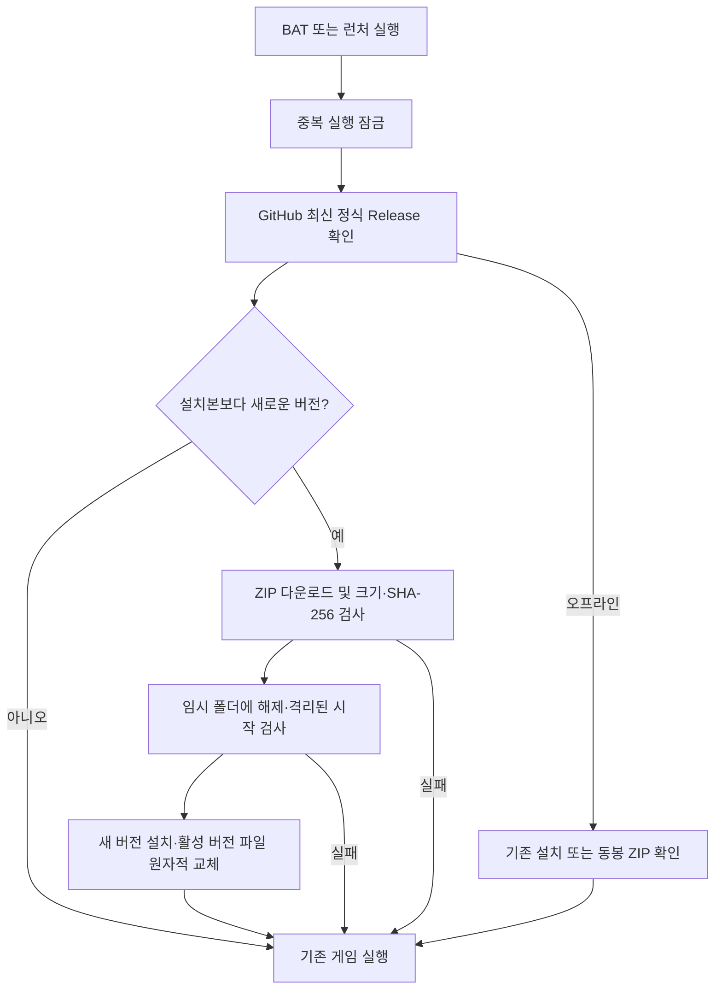

# Windows / Python BAT 배포와 자동 업데이트

현재 배포 경로는 공개 저장소 [badbed7/morning-bloom Releases](https://github.com/badbed7/morning-bloom/releases)입니다. GitHub 계정이나 토큰 없이 업데이트를 받습니다. 사용자 배포에는 MSIX를 사용하지 않습니다.

## 사용자 실행

- **Python 유지:** 최신 `MorningBloom-<버전>-Python-BAT.zip`을 전부 풀고 `run-python.bat`을 실행합니다. Python 3.12 64비트, Python Launcher와 Tcl/Tk를 한 번 설치해야 합니다. 첫 의존성 설치에는 인터넷이 필요합니다.
- **EXE:** 최신 `MorningBloom-<버전>-Windows-x64.zip`을 전부 풀고 `MorningBloom.exe` 또는 같은 폴더의 `run.bat`을 실행합니다. Python을 따로 설치하지 않습니다.

BAT나 EXE만 다른 곳으로 옮기지 마세요. 함께 들어 있는 ZIP과 버전 정보를 보관하면 네트워크 오류 시에도 포함된 버전을 설치할 수 있습니다. Python 의존성이 이미 준비된 PC는 오프라인으로도 시작할 수 있습니다.

**v0.6.0 이하의 BAT·런처는 v0.7.0 배포 ZIP으로 한 번 교체해야 합니다.** 이전 BAT는 업데이트 검사가 없었고, 이전 EXE는 존재하지 않는 `morning-bloom-releases` 주소로 빌드되었습니다. 게임 저장은 그대로 사용합니다. 이후에는 같은 BAT·런처로 실행하면 됩니다.

## 실행 순서



업데이트 점검 후 게임을 시작하므로, 새 버전을 발견하면 별도의 수동 업데이트 버튼 없이 그 실행부터 적용합니다. 동봉 ZIP이 원격 최신 버전과 같으면 다운로드하지 않습니다. 신규 설치에서는 원격 버전과 동봉 버전 중 가장 최신의 정상 버전을 설치합니다. 둘 다 준비할 수 없으면 오류와 로그 경로를 표시합니다.

EXE는 `update.json`과 `MorningBloom-game.zip`, Python BAT는 `python-update.json`과 `MorningBloom-python.zip`을 사용합니다. 각각 `version`, `size`, `sha256`, 허용된 GitHub 다운로드 주소를 검사합니다. 두 방식은 같은 버전별 설치·원자적 교체 코드를 공유합니다.

Python 버전은 EXE로 변환하지 않고 `.py` 파일을 별도 Python 프로세스로 실행합니다. 의존성은 Python 버전과 `requirements.txt` 해시별 가상 환경으로 보관하며 준비된 환경에서는 pip를 다시 실행하지 않습니다. 새 의존성 설치에 실패해도 이전 버전의 환경을 변경하지 않습니다.

## 저장 보존과 실패 처리

| 위치 | 용도 |
| --- | --- |
| `%LOCALAPPDATA%/MorningBloomPython` | 기존 일반·개발자 정원과 백업. 두 실행 방식이 공유 |
| `%LOCALAPPDATA%/MorningBloomLauncher` | EXE 설치·현재 버전·업데이트 로그·공용 실행 잠금 |
| `%LOCALAPPDATA%/MorningBloomPythonLauncher` | Python 설치·가상 환경·현재 버전·로그 |

설치 파일만 교체합니다. 저장 폴더는 압축 해제와 삭제 대상에 포함하지 않습니다. 새 버전은 빈 임시 정원으로 시작 검사를 통과한 뒤에만 활성화합니다. 게임을 실제 실행할 때 기존 저장 이전·백업 기능을 사용합니다.

다운로드 중단, 손상된 ZIP, 위험한 압축 경로, 의존성 설치 실패, 실행 점검 실패 시 현재 버전 포인터를 바꾸지 않습니다. 이전 설치는 남겨 둡니다. 저장 형식이 바뀔 수 있으므로 실제 게임을 실행한 이후에는 임의로 이전 버전으로 되돌리지 않습니다.

BAT와 EXE는 공용 잠금을 게임 종료까지 유지합니다. 이미 실행 중이면 두 번째 런처는 종료하고 다음 실행에서 업데이트합니다. 실행 중인 게임을 강제로 종료하거나 그 파일을 덮어쓰지 않습니다.

각 설치 폴더의 `update.log`는 조회·업데이트 실패, `startup-check.log`는 새 버전 시작 점검, Python의 `python-setup.log`는 의존성 설치 오류를 기록합니다.

## 새 버전 배포

1. 코드와 테스트를 완료합니다.
2. `release/VERSION`을 이전보다 높은 버전으로 올립니다.
3. main에 push하면 **Windows release**가 EXE와 Python BAT를 모두 빌드하고 실행 검사합니다.
4. 모든 ZIP과 두 업데이트 JSON을 draft Release에 올린 뒤, 정식 최신 Release로 한 번에 게시합니다.
5. 인증 정보 없이 두 공개 업데이트 주소를 조회해 게시 버전을 확인합니다. 사용자는 다음 실행에서 새 버전을 받습니다.

별도의 배포 전용 저장소나 개인 액세스 토큰은 필요하지 않습니다. 워크플로는 현재 공개 저장소의 기본 `GITHUB_TOKEN`으로 Release를 게시합니다. 저장소를 비공개로 바꾸면 일반 사용자의 업데이트가 중단됩니다.

Google Desktop OAuth 값은 Actions variable `GOOGLE_OAUTH_CLIENT_ID`와 Actions secret `GOOGLE_OAUTH_CLIENT_SECRET`에 설정합니다. 두 값은 설치 앱에 포함되지만 저장소와 CI 로그에는 직접 기록하지 않습니다. 사용자 토큰이나 비밀번호는 패키지에 넣지 않습니다.

Windows / Python 3.12에서 수동 빌드:

```powershell
py -3.12 -m pip install -r python/requirements.txt -r release/requirements-build.txt
py -3.12 release/build_windows.py
py -3.12 release/build_python.py
```

출력은 `release-output`입니다. 자동 빌드는 게임·업데이터 테스트와 EXE·Python 양쪽의 격리된 실행 검사를 통과해야 게시됩니다. 이전의 별도 `Python BAT release` 작업은 이 흐름으로 통합했습니다.

## 범위

새 버전 게임·리소스·Python 의존성을 업데이트합니다. 업데이트 프로토콜이나 런처 자체가 바뀌면 새 배포 ZIP을 한 번 받아야 합니다. 운영체제 보안 기능에 의해 차단된 EXE·DLL의 실행 허용 여부는 이 업데이트 기능과 별개입니다. HTTPS와 SHA-256은 전송 무결성을 검사하며 제작자 코드 서명을 대신하지 않습니다.
